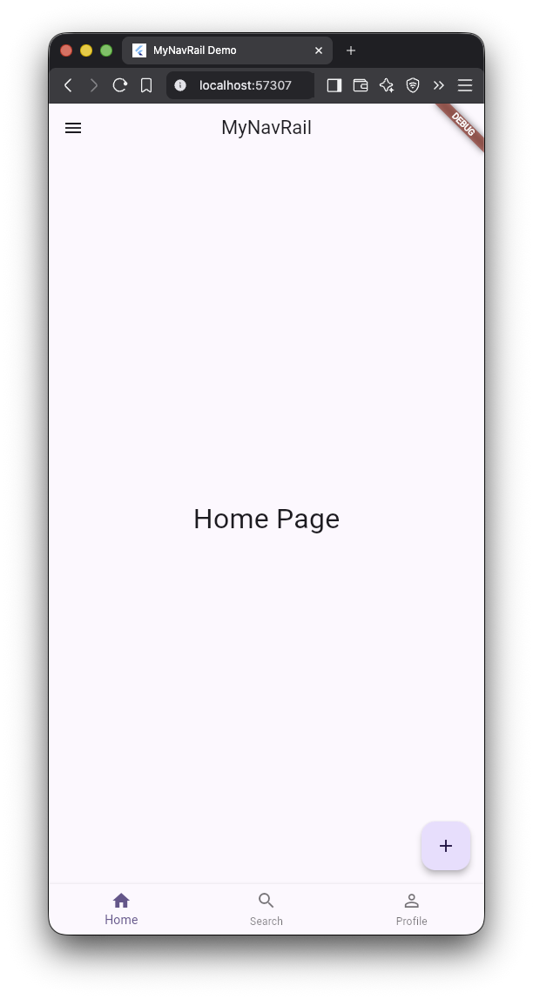
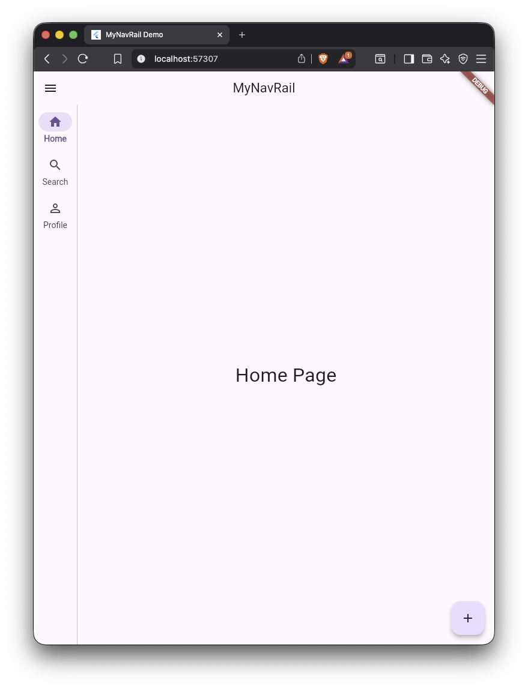
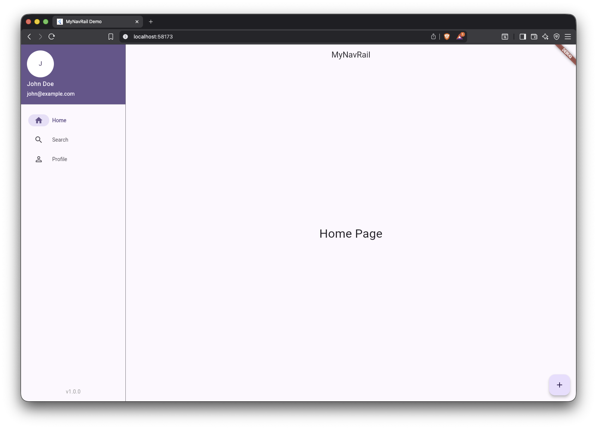

# my_nav_rail

**Moslashuvchan. Aqlli. Material 3.**  
Bir vidjet — uchta interfeys: mobil, planshet, kompyuter.

[](https://pub.dev/packages/my_nav_rail)
[](https://github.com/yourusername/my_nav_rail)
[](LICENSE)

---

## Interfeyslar

| Mobil                      | Planshet | Kompyuter |
|----------------------------|----------|-----------|
|  |  |  |

---

## Xususiyatlar

- **Bir marta yozing — hamma joyda ishlaydi** (`NavigationMyDestination` bilan)
- **Material 3** to'liq qo'llab-quvvatlanadi
- **FAB** har bir platformada to'g'ri joylashadi
- **Drawer sarlavhasi va pastki qismi** (header/footer)
- **Qisqa (dense) va keng (extended) NavigationRail**
- **100% test qamrovi**
- **CI/CD (GitHub Actions)**
- **To'liq hujjatlashtirilgan** (DartDoc)

---

## O'rnatish

`pubspec.yaml` ga qo'shing:

```yaml
dependencies:
  my_nav_rail: ^1.0.0